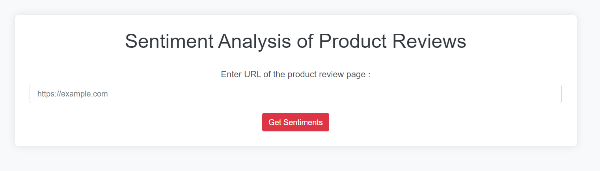
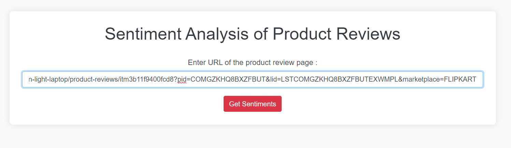
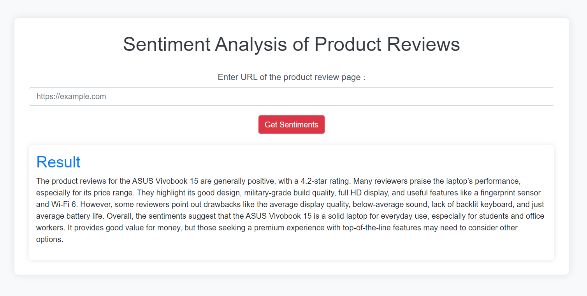

# Sentiment Analysis of Product Reviews

This project is a web-based tool that performs sentiment analysis on product reviews. By scraping reviews from product review pages using the Firecrawl SDK and analyzing the sentiment using the Gemini API, this tool provides insights into customer opinions about various products.

## Features

- **Scrape Reviews**: Uses Firecrawl SDK to scrape reviews from product review pages through a provided URL.
- **Sentiment Analysis**: Utilizes the Gemini API to analyze the sentiment of the scraped reviews, categorizing them as positive, negative, or neutral.
- **Data Visualization**: Visualizes sentiment results to provide insights into customer feedback.

## Technologies Used

- **Firecrawl SDK**: For scraping reviews from product review pages.
- **Gemini API**: For performing sentiment analysis on the scraped reviews.
- **Python**: Core programming language used for implementing the scraping and sentiment analysis logic.
- **Flask**: A lightweight WSGI web application framework used to build the web interface.
- **HTML/CSS/JavaScript**: For frontend development and data visualization.

## How My Website looks

